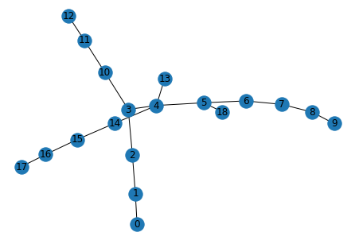

# Are you an Amoeba?

This repo provides a simple amoeba detection tool. Works for local and global amoebas. For a much more complete program see Marcos Laffitte's repo at [2]. Finding more efficient alternatives to both our algorithms is an open problem in algebraic graph theory: see Chapter 6 of [3].

## Mathematical background

Let $G$ be a graph and $e$ an edge of $G$. We say $(e\to g)$ is a *feasible edge replacement* if $G-e+g$ is isomorphic to $G$. We say a graph is an *amoeba* is it can be transformed into any isomorphic copy of itself by means of a sequence of feasible edge replacements. For more details on amoebas and the difference between *local* and *global* amoebas, consult [1].

## Usage

The functions in the code take `networkX` graph objects as input. An example proving that the graph below is a *local amoeba* is provided in the code.

## References

[1] Caro, Y., Hansberg, A., Montejano, A. (2023). *Graphs isomorphisms under edge-replacements and the family of amoebas*. **Electronic Journal of Combinatorics** 30(3) P3.9. [Link](https://www.combinatorics.org/ojs/index.php/eljc/article/download/v30i3p9/pdf)

[2] [github.com/MarcosLaffitte/Amoebas](https://github.com/MarcosLaffitte/Amoebas)

[3] Marcos Emmanuel González Laffitte, Tesis de Maestría en Ciencias Matemáticas, UNAM, "Estudio de Amoebas y sus Propiedades: Detección Computacional de esta Familia de Gráficas y el Caso de los Reemplazos Raros", p. 111, 2022. Complete text Available in Spanish [here](http://132.248.9.195/ptd2022/septiembre/0831065/Index.html).
